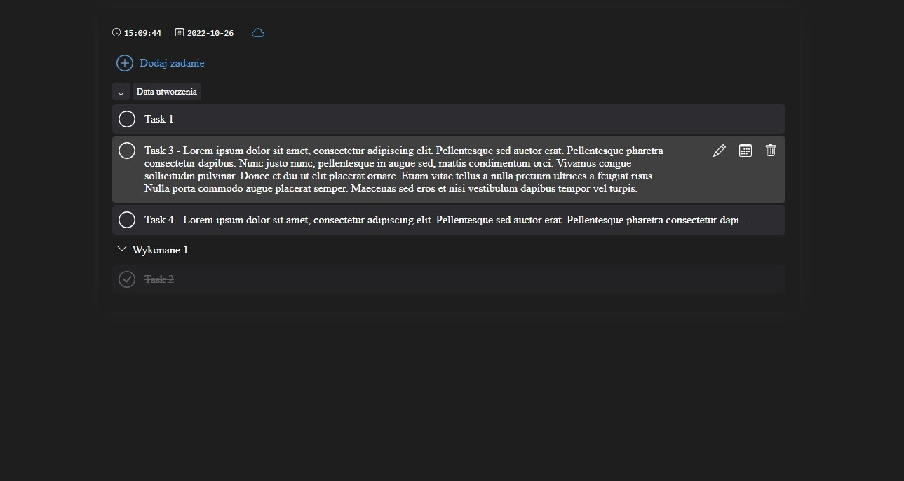

# React practice - TODO List

The project was made as part of React training and related technologies.

## Table of contents

- [Overview](#overview)
  - [Assumptions](#assumptions)
  - [Screenshot](#screenshot)  
  - [Technologies](#technologies)
  - [Links](#links)
- [Author](#author)

## Overview

### Assumptions

- Add, edit and delete tasks 
- Providing functionality in the active state of tasks  
- Saving tasks locally and on the server  
- Offline mode

### Screenshot

### Technologies  

- React (rendering)
- Styled Components (styling)
- JS (logic)
- Jest + Testing Library (testing)
- json-server (remote storage)
- localStorage (local storage)

### Links

- Project repository: https://github.com/RobStk/react-practice-todo-list

## Author

- Website: https://github.com/RobStk
